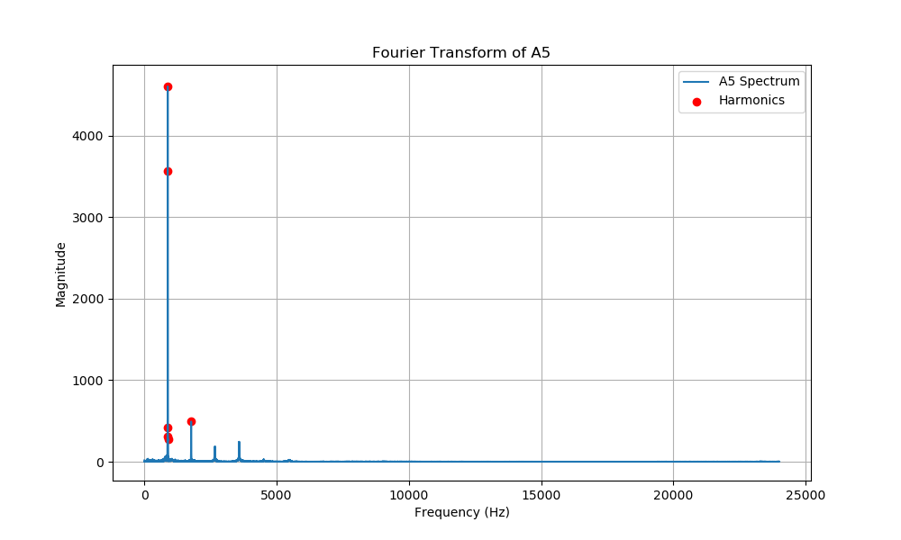
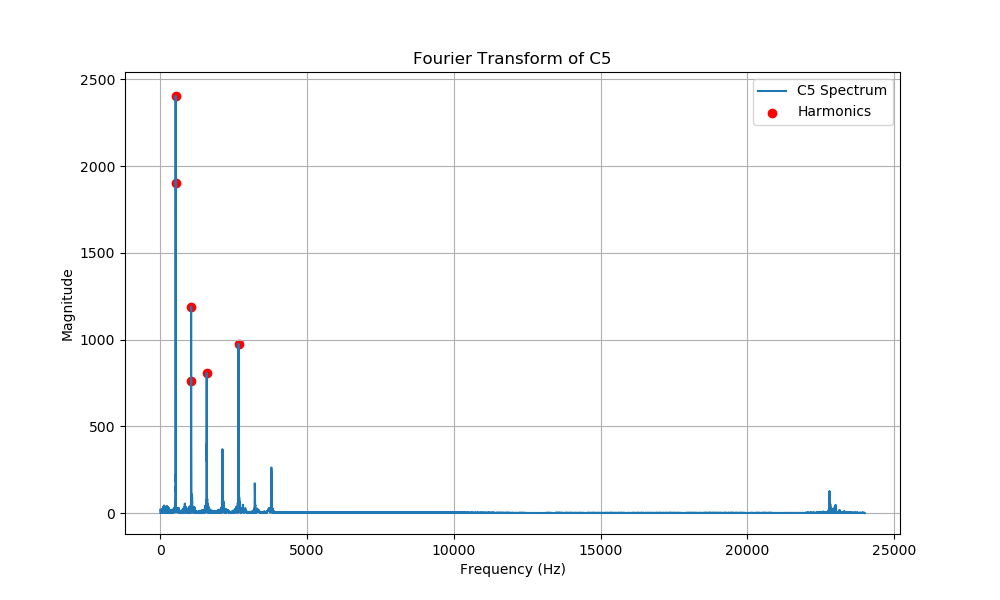
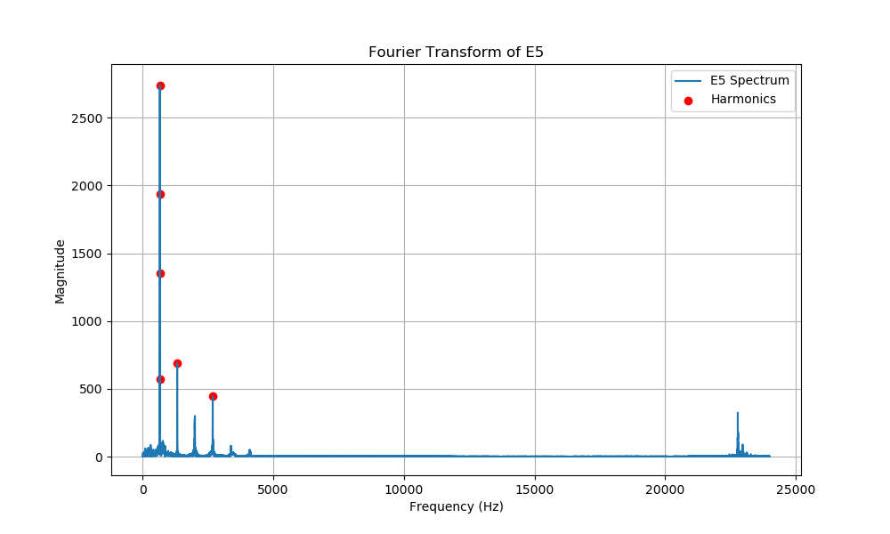
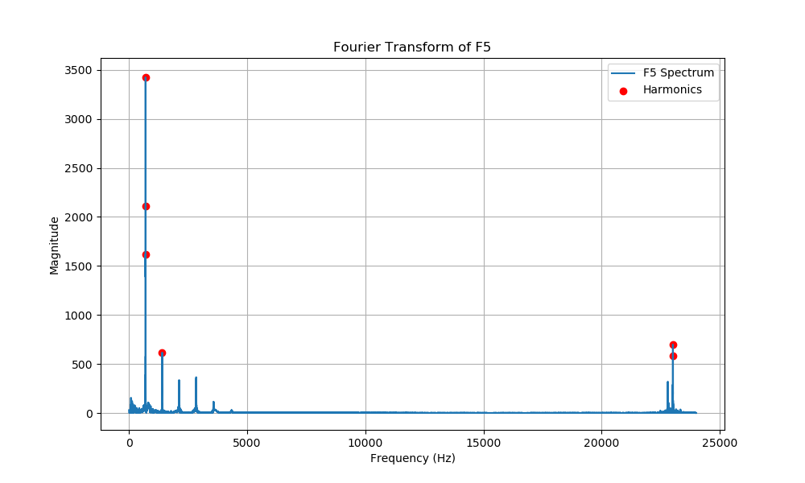
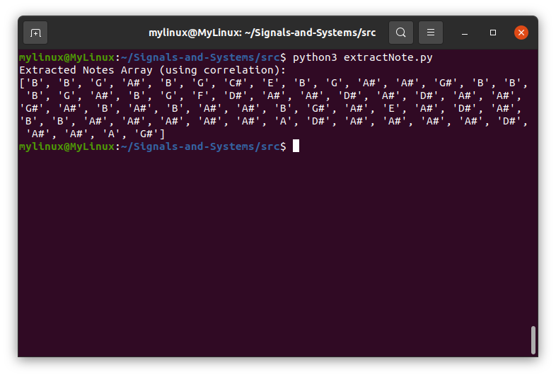

# 1. Generating Harry Potter Theme Notes in Python

## Introduction
This Python script reads musical notes from a MATLAB file (`notes.m`), converts them into corresponding frequencies, generates a waveform for each note, and saves the resulting sound as a `.wav` file.

---

## Dependencies
```python
import numpy as np
from scipy.io.wavfile import write
import re
```
- `numpy` for numerical computations and signal generation.
- `scipy.io.wavfile.write` for saving the generated waveform as an audio file.
- `re` for extracting note data from `notes.m`.

---

## Sampling Configuration
```python
fs = 44100  
silence_duration = 0.025
final_signal = []
noteHarryPotter = []
```
- The sampling rate is set to 44.1 kHz.
- A short silence (0.025s) is inserted between notes to enhance clarity.

---

## Defining Note Frequencies
```python
note_frequencies = {
    'C': 261.63, 'C#': 277.18, 'D': 293.66, 'D#': 311.13, 'E': 329.63,
    'F': 349.23, 'F#': 369.99, 'G': 392.00, 'G#': 415.30, 'A': 440.00,
    'A#': 466.16, 'B': 493.88
}
```
- This dictionary stores the standard frequencies for each note in the 4th octave.

---

## Function to Calculate Frequency
```python
def get_frequency(note, octave):
    base_freq = note_frequencies[note]
    return base_freq * (2 ** (octave - 4))
```
- Converts a note into its corresponding frequency based on octave number.

---

## Reading Notes from `notes.m`
```python
with open('notes.m', 'r') as file:
    content = file.read()
    matches = re.findall(r"'(.*?)'", content)
    noteHarryPotter.extend(matches)
```
- Extracts notes from `notes.m` using regex.
- Notes are stored in `noteHarryPotter` list.

---

## Processing Notes and Durations
```python
melody = []
durations = []
for note_entry in noteHarryPotter:
    note, octave, duration = note_entry.split()
    melody.append(get_frequency(note, int(octave)))
    durations.append(float(duration))
```
- Splits each entry into note name, octave, and duration.
- Converts the note into its corresponding frequency.

---

## Generating Waveform
```python
for i, freq in enumerate(melody):
    t = np.linspace(0, durations[i], int(fs * durations[i]), endpoint=False)
    note_signal = np.sin(2 * np.pi * freq * t)
    final_signal.extend(note_signal)
    silence = np.zeros(int(fs * silence_duration))
    final_signal.extend(silence)
```
- Creates sine waves for each note based on its duration.
- Appends a brief silence between notes for clarity.

---

## Normalization and Saving
```python
final_signal = np.array(final_signal)
final_signal = final_signal / np.max(np.abs(final_signal))
write('../Audio/noteHarryPotter.wav', fs, (final_signal * 32767).astype(np.int16))
print("Audio file saved successfully.")
```
- Converts the list into a NumPy array.
- Normalizes the amplitude to avoid clipping.
- Saves the generated waveform as `noteHarryPotter.wav`.

---

## Output
- The script generates `noteHarryPotter.wav` in the `../Audio/` directory.
- This file contains the synthesized melody based on the `notes.m` file.

---

## Usage
Run the script:
```sh
python script.py
```
Ensure `notes.m` is present in the same directory and contains properly formatted note data.

---
---

# 2. Harmonic Analysis and Synthesis of Audio Signals

## Introduction

This script performs harmonic analysis and synthesis on `.wav` audio files using Fourier Transform. It extracts harmonic peaks from audio signals, plots their frequency spectrum, and reconstructs a smoothed version of an input signal. The results include visual plots and an Excel file with harmonic coefficients.

## Dependencies

Ensure you have the following Python packages installed:

```bash
pip install numpy pandas matplotlib scipy openpyxl
```

## How It Works

### 1. **Harmonic Extraction from Audio Files**

**Relative Code:**

```python
directory = '../Audio/Octave5'
plots_dir = '../Plots'
os.makedirs(plots_dir, exist_ok=True)

harmonic_data = []
for file in sorted(os.listdir(directory)):
    if file.endswith('.wav'):
        note_name = file.split('.')[0]
        fs, signal = read(os.path.join(directory, file))
        if len(signal.shape) > 1:
            signal = np.mean(signal, axis=1)
        signal = signal / np.max(np.abs(signal))
        fft_spectrum = np.fft.fft(signal)
        frequencies = np.fft.fftfreq(len(fft_spectrum), 1 / fs)
        magnitude = np.abs(fft_spectrum)
        positive_freqs = frequencies[:len(frequencies) // 2]
        positive_magnitude = magnitude[:len(magnitude) // 2]
```

The script processes `.wav` files from `../Audio/Octave5`, computes their Fourier Transform, and extracts harmonic components.

<div style="display: flex; justify-content: center;">
<div align="center" style= "margin: 10px;">
    <p></p>
    
</div>
</div>

<div style="display: flex; justify-content: center;">
<div align="center" style= "margin: 10px;">
    <p></p>
    
</div>
</div>


<div style="display: flex; justify-content: center;">
<div align="center" style= "margin: 10px;">
    <p></p>
    
</div>
</div>

### 2. **Finding Peaks in the Frequency Spectrum**

**Relative Code:**

```python
peaks, _ = find_peaks(positive_magnitude, height=0.05 * np.max(positive_magnitude))
peak_frequencies = positive_freqs[peaks]
peak_magnitudes = positive_magnitude[peaks]
```

This extracts frequency peaks from the Fourier Transform result, selecting the most prominent harmonics.

### 3. **Plotting the Frequency Spectrum**

**Relative Code:**

```python
plt.figure(figsize=(10, 6))
plt.plot(positive_freqs, positive_magnitude, label=f'{note_name} Spectrum')
plt.scatter(peak_frequencies[sorted_indices], peak_magnitudes[sorted_indices], color='red', marker='o', label='Harmonics')
plt.xlabel('Frequency (Hz)')
plt.ylabel('Magnitude')
plt.title(f'Fourier Transform of {note_name}')
plt.grid()
plt.legend()
plot_filename = os.path.join(plots_dir, f'{note_name}_spectrum.png')
plt.savefig(plot_filename)
plt.close()
```

This generates and saves frequency spectrum plots for each audio file in `../Plots`.

<div style="display: flex; justify-content: center;">
<div align="center" style= "margin: 10px;">
    <p></p>
    
</div>
</div>

<div style="display: flex; justify-content: center;">
<div align="center" style= "margin: 10px;">
    <p></p>
    
</div>
</div>


### 4. **Saving Harmonic Data to Excel**

**Relative Code:**

```python
columns = ['Note'] + [f'Harmonic {i+1} Freq (Hz)' for i in range(6)] + [f'Harmonic {i+1} Mag' for i in range(6)]
df = pd.DataFrame(harmonic_data, columns=columns)
df.to_excel('../Harmonics.xlsx', index=False)
```

Extracted harmonic data is saved in `../Harmonics.xlsx` for further analysis.

### 5. **Audio Signal Smoothing and Reconstruction**

**Relative Code:**

```python
input_file = '../Audio/noteHarryPotter.wav'
fs, signal = read(input_file)
if len(signal.shape) > 1:
    signal = np.mean(signal, axis=1)
signal = signal / np.max(np.abs(signal))
```

Loads and normalizes an audio file before extracting harmonics.

### 6. **Synthesizing a Smoothed Version of the Signal**

**Relative Code:**

```python
smoothed_signal = np.zeros_like(signal, dtype=np.float64)
for freq, mag in zip(top_harmonics['frequencies'], top_harmonics['magnitudes']):
    smoothed_signal += mag * np.cos(2 * np.pi * freq * t)
```

This reconstructs a smoothed version of the original audio based on the detected harmonics.

### 7. **Applying Damping and Gain Adjustments**

**Relative Code:**

```python
damping = np.exp(-t / 5)
smoothed_signal *= damping
gain = 1.5
smoothed_signal /= np.max(np.abs(smoothed_signal))
smoothed_signal *= gain
```

Damping is applied to reduce noise and a gain factor is introduced to enhance the output signal.

### 8. **Saving the Smoothed Audio**

**Relative Code:**

```python
output_file = '../Audio/noteOptimized..wav'
write(output_file, fs, (smoothed_signal * 32767).astype(np.int16))
print(f"Smoothed audio saved to: {output_file}")
```

The final synthesized audio is saved as `noteOptimized..wav`.

## Output Files

- **Excel File:** `../Harmonics.xlsx` (Harmonic coefficients of audio files)
- **Plots:** `../Plots/{note_name}_spectrum.png`
- **Processed Audio:** `../Audio/noteOptimized..wav`

## Usage

Run the script using:

```bash
python script.py
```

Ensure the input `.wav` files exist in `../Audio/Octave5`.

## Conclusion

This script extracts and visualizes harmonics from audio files, saves their coefficients, and reconstructs a smoothed audio version for further analysis and processing.

---
---

# 3. Extracting Initial Note from an Audio File

## Overview
This script reads an audio file, performs a Fourier Transform to extract its frequency spectrum, and identifies the closest musical note to the dominant frequency.

## Code Breakdown

### Importing Required Libraries
```python
import numpy as np
from scipy.io.wavfile import read
import os
```
The script uses `numpy` for mathematical computations, `scipy.io.wavfile` to read WAV files, and `os` to check file existence.

### Function to Extract the Initial Note
```python
def extract_initial_note(file_path):
    fs, signal = read(file_path)
    signal = signal / np.max(np.abs(signal))
    fft_spectrum = np.fft.fft(signal)
    frequencies = np.fft.fftfreq(len(fft_spectrum), 1 / fs)
    magnitude = np.abs(fft_spectrum)
    positive_freqs = frequencies[:len(frequencies) // 2]
    positive_magnitude = magnitude[:len(magnitude) // 2]
    peak_index = np.argmax(positive_magnitude)
    detected_freq = positive_freqs[peak_index]
```
- Reads the WAV file and normalizes the signal.
- Computes the FFT to transform the signal into the frequency domain.
- Extracts only positive frequencies and finds the highest magnitude peak to determine the dominant frequency.

### Mapping Frequency to the Closest Musical Note
```python
    note_frequencies = {
        'C': 261.63, 'C#': 277.18, 'D': 293.66, 'D#': 311.13, 'E': 329.63,
        'F': 349.23, 'F#': 369.99, 'G': 392.00, 'G#': 415.30, 'A': 440.00,
        'A#': 466.16, 'B': 493.88
    }
    closest_note = min(note_frequencies, key=lambda note: abs(note_frequencies[note] - detected_freq))
    return detected_freq, closest_note
```
- Defines standard note frequencies.
- Finds the closest musical note by minimizing the absolute frequency difference.

### Processing an Audio File
```python
file_path = "../Audio/noteHarryPotter.wav"
if os.path.exists(file_path):
    detected_freq, closest_note = extract_initial_note(file_path)
    print(f"Detected Frequency: {detected_freq:.2f} Hz")
    print(f"Closest Note: {closest_note}")
else:
    print("File not found. Please check the path.")
```
- Checks if the specified audio file exists.
- Calls `extract_initial_note()` and prints the detected frequency and closest note.

## Output

<div style="display: flex; justify-content: center;">
<div align="center" style= "margin: 10px;">
    <p></p>
    
</div>
</div>

## Usage
1. Ensure the WAV file exists at the given path.
2. Run the script to detect the fundamental frequency and closest note.
3. Modify the `file_path` variable to analyze different audio files.

## Conclusion
This script is useful for analyzing musical recordings and determining their dominant notes, which can be beneficial in music transcription and analysis.

